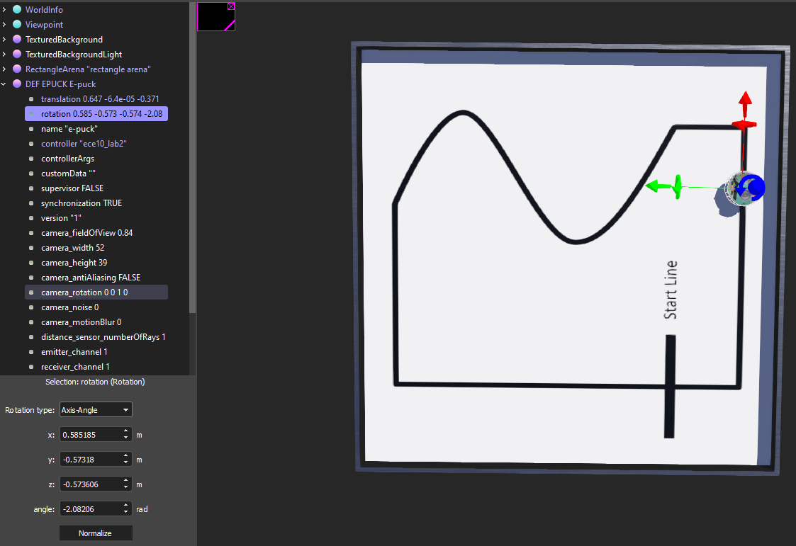
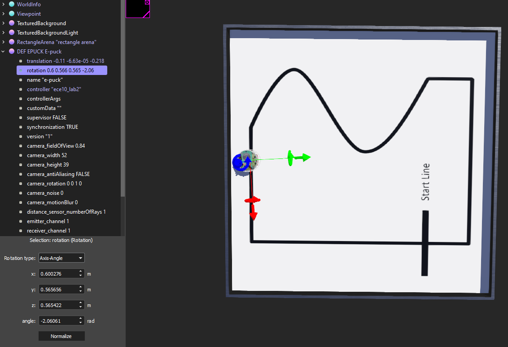
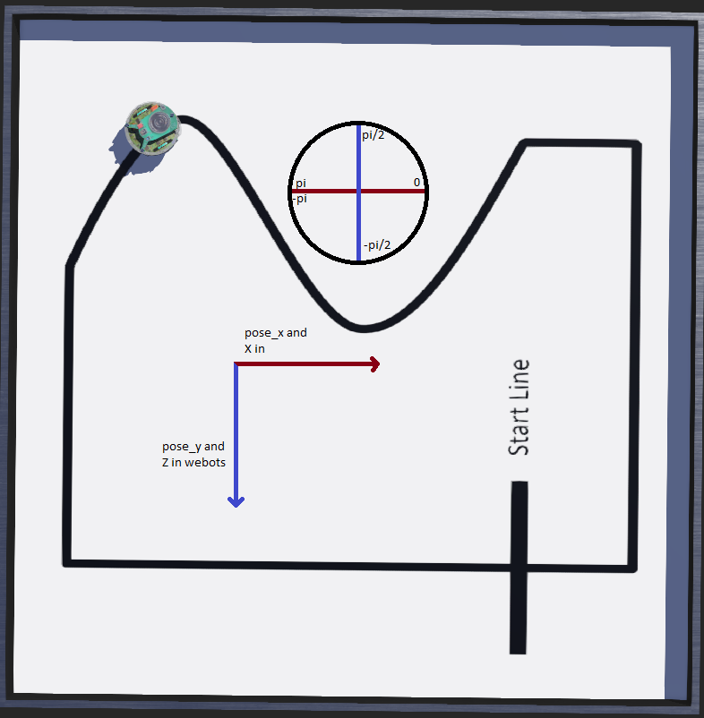

Lab Report
# I'm not really sure if we are only supposed to turn in the one lab report, and what to turn in to CANVAS.
# I will just leave this readme on Git and copy paste the same thing into a LaTeX to turn in on CANVAS with the code.

1.	Group Members: Jacob Sickafoose (jsickafo) -Master repo

2.	On every time step the robot reads from the line sensors, makes a decision on which direction
	to move and calculates the change in world coordinates resulting from that.

3.	The only time the time step is looked at is in updating the odometry. If the time step is not
	exactly TIME_STEP long, then the calculation for distance traveled during that time step
	would be inaccurate. Small errors such as this would accumulate over time the way this
	controller is programmed.

4.	In Part 1, the ePuck's average speed was found by taking the change in distance only in the X
	direction while the ePuck was moving forward at max speed for approximately 4 seconds. I
	calculated EPUCK_MAX_WHEEL_SPEED = 0.1262m/s. Calculating this with the ePuck datasheet,
	MAX_SPEED * EPUCK_WHEEL_RADIUS = 6.28(rad/s) * 0.0205(m) = 0.12874m/s.

5. 	The Webots simulator says that the ePuck translation(x, y, z) = (0.498596, -6.39506e-05, 0.0637583)
	at the startline so I think it would be that same pose every time. Except in webots, y is out of
	the board so it should be pose_x = x, and pose_y = z.

6.	I implemented the loop closure as the hints suggested. I made sure all the sensors reading the line
	was the startline by making it read that for >8 time steps. After these time steps and I know it's
	on the line, I waited for the start line to not be read anymore before implementing any pose changes.

	After I was sure I was only triggering once per lap and at the startline, I simply set the pose to the
	previous pose. I also had the previous pose actually change because I wasn't sure if it should just 
	always reset to the pose of the very first lap. It's really easy to change it back to that but I made
	a guess for what was expected.

7. 	I probably spent around 5 hours working on this lab. I've been working on it here and there because
	I'm super busy with ECE129 and ECE167 which I also have big deadlines for this week.

8.	In my implementation of the pose, I was thrown for several loops. I started out trying to align my
	theta to that of the simulator coords because I know X and Y are calculated from that. It took me
	a long time to realize that the radians field in the rotation of the ePuck is not the theta I was
	looking for. It would results that were not at all consistent with the ePuck's orientation. Here
	is a screenshot of the ePuck facing up and down with the same value of rotation:

	I just decided to look at how Webots was counting the coordinates when the ePuck moved by looking at
	the translation tab. I settled on making the axis the following:

	I wasn't sure what we were really supposed to do, but at least my pose was close to what Webots was saying.